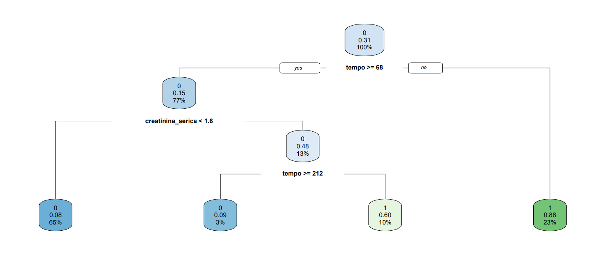
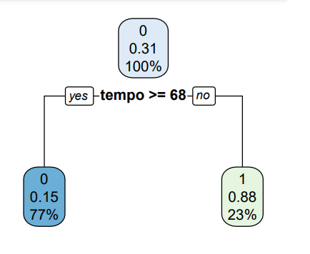
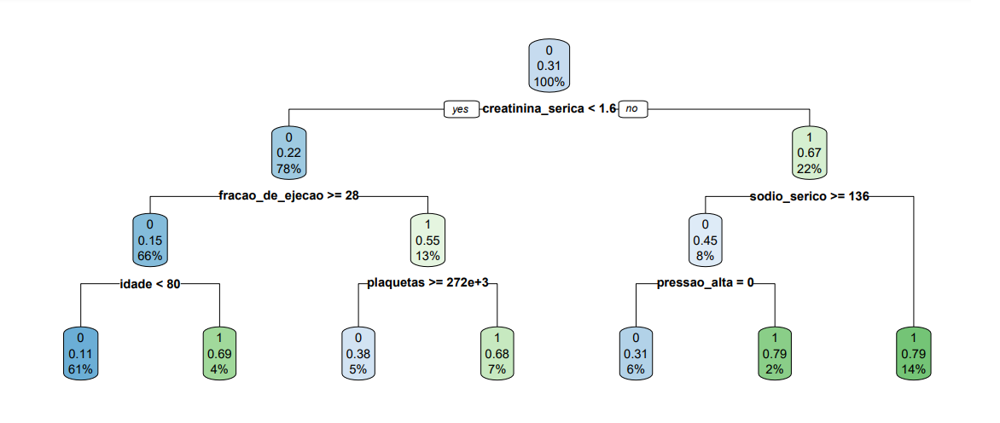
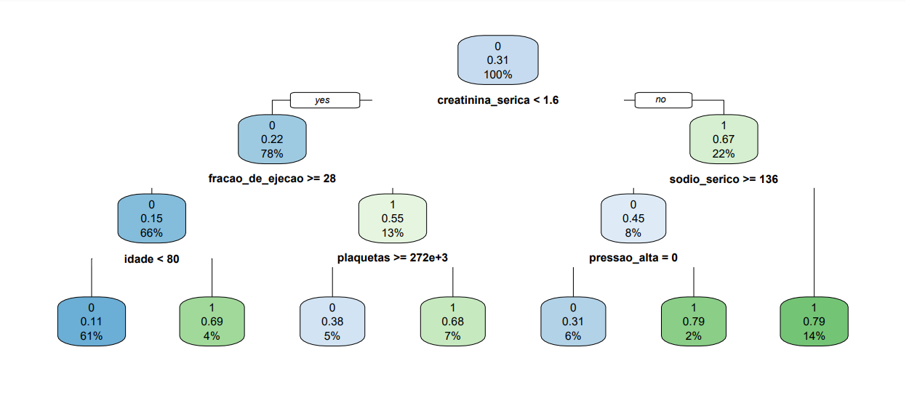
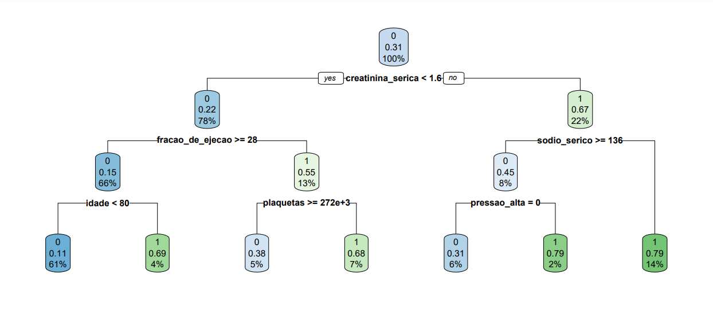
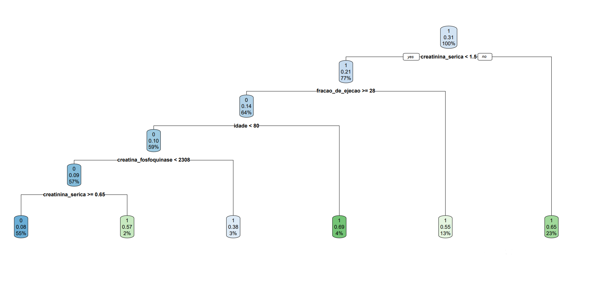

# Projeto de Machine Learning para a Prevenção de Obitos por Ataques Cardiácos

## Descrição
Esse algoritimo de machine learning, desenvolvido apenas em linguagem R, tentará prever o evento de obito gerado por um ataque cardiaco. O projeto foi desenvolvido com base em um dataset que possui informações de 5000 pacientes que sofreram do infarto miocárdico, esse conta com 12 variáveis preditoras e uma variavel alvo.

O projeto tem a intenção de utilizar e incentivar o uso de machine learning para previnir fatalidades no âmbito da medicina.

## Pré-requisitos
[R na versão 4.4.2 ou superior](https://posit.co/download/rstudio-desktop/)

[Rstudio na versão 2024.12.0+467 ou superior](https://posit.co/download/rstudio-desktop/)

Arquivo contendo dataset traduzido (_heart_failure_clinical_records.csv_) disponível nesse mesmo repositório [(Dataset original extraído do Kaggle)](https://www.kaggle.com/datasets/aadarshvelu/heart-failure-prediction-clinical-records)

## Utilização do codigo no Rstudio
Clone o projeto na sua máquina utilizando o git bash:

```bash 
git clone https://github.com/usuario/repo.git
```
Ja no R instale e carregue as bibliotecas necessárias:

```r

install.packages("rpart")         
install.packages("rpart.plot")    
install.packages("caret")         
install.packages("dplyr")         
install.packages("ggplot2")      
install.packages("plotly")                 

library(rpart)
library(rpart.plot)
library(caret)
library(dplyr)
library(ggplot2)

```
Substitua o argumento da função read.csv pelo caminho do arquivo do dataset baixado previamente como solicitado

```r
dados <- read.csv("Caminho do arquivo do dataset aqui!!!")
```

Esse projeto está dividido em: 

1. _Instalação e carregamento de bibliotecas e de dataset_
2. _Tratamento de dados_
3. _Criação do modelo_
    * _Primeira Versão do modelo_
    * _Segunda Versão do modelo_
    * _Terceira versão do modelo_

Caso queira analisar o código com mais a atenção é recomendado que execução de uma parte por vez seguindo essa ordem(colocar um gif aqui)

Também é recomendado, para que uma melhor leitura dos comentários dentro do código seja efetuada, que a correção ortográfica do seu Rstudio seja desativada:

_tools_ -> _Global Opotions_ -> _Spelling_ -> _desmarque a caixa use real time spell-checking_


## Uma análise sobre as três versões do modelo


### Primeira versão do modelo
* Variavel artificial _insuficiencia renal binaria_ criada
* Adição de uma variável aleatória
* Valor de CP: 0.03
* acurácia: 0.8719
* sensitividade: 0.8021
* especificidade: 0.9038



- Valor de CP : 0.1
- acurácia: 0.8472
- Sensitividade: 0.6043
- Especificidade: 0.9582



É possível verificar que, mesmo mudando os valores do parâmetro de complexidade a variável “tempo” continua sendo a mais relevante das condições que podem levar um paciente à óbito.

### Segunda versão do modelo
- Exclusão da variável tempo
- Variável artificial creatina insuficiência renal binaria criada
- Adição de uma varável aleatória
- Valor de CP: 0.03
- Acurácia: 0.8319
- Sensibilidade: 0.7085
- Especificidade: 0.8882



- Exclusão da variável aleatória
- Exclusão da variável tempo
- Variável artificial creatina insuficiência renal binaria criada
- Valor de CP: 0.03
- Acurácia: 0.8319
- Sensibilidade: 0.7085
- Especificidade: 0.8882



Inicialmente houve a exclusão da variável “tempo” que levou à uma distribuição de importância das variáveis de maneira mais igualitária. Logo após, a variável aleatória foi também excluída, porém, a presença dessa de mostrou irrelevante visto que os valores de acurácia, sensitividade e especificidade não sofreram alterações

### Terceira versão do modelo

- Exclusão da variável aleatória
- Exclusão da variável tempo
- Variável artificial creatina insuficiência renal binaria criada
- Ponto de corte para considerar que um paciente virá a óbito diminuído
- Valor de CP: 0.03
- Acurácia: 0.7999
- Sensibilidade: 0.7894
- Especificidade 0.8047



- Exclusão da variável aleatória
- Exclusão da variável tempo
- Variável artificial creatina insuficiência renal binaria criada
- Ponto de corte para considerar que um paciente virá a óbito diminuído
- Aumento do peso de erros em falsos negativos
- Valor de CP: 0.03
- Acurácia: 0.7939
- Sensibilidade: 0.8723
- Especificidade 0.7570



Um modelo com maior sensibilidade é um modelo que gera menos falsos negativos. Em modelos gerados para prever a ocorrência de doenças de alto índice de contágio em um paciente, em teoria, é melhor que esse tenha uma sensibilidade mais elevada. Visto que os malefícios de um falso negativo são maiores que de um falso positivo.

Nessa versão, a lógica de que um falso negativo é pior que um falso positivo foi usada. Ou seja, mesmo que o algorítimo indique, ainda que de maneira errônea, que um paciente virá a óbito por conta de um ataque cardiáco, é melhor que o paciente sofra as consequências dos metodos utilizados para previnir um infarto do que esse vir a óbito.